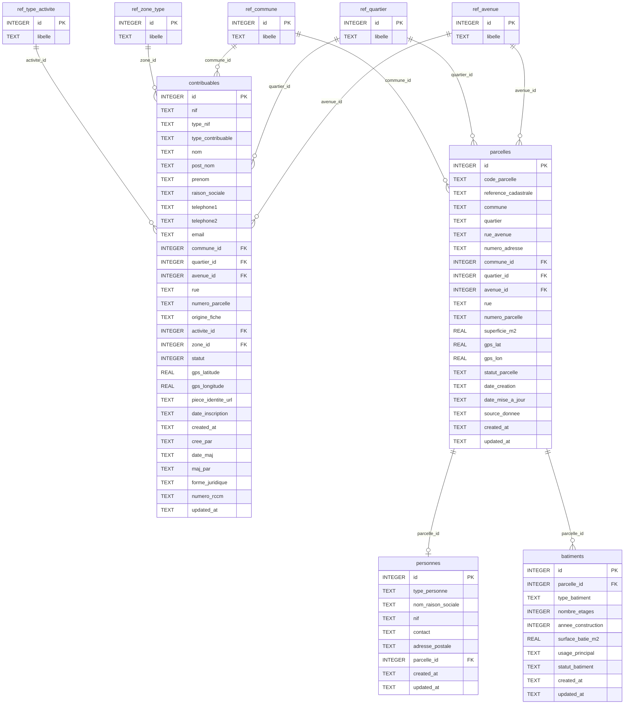

# Database Schema Diagram

```mermaid
erDiagram
    ref_type_activite {
        INTEGER id PK
        TEXT libelle
    }

    ref_zone_type {
        INTEGER id PK
        TEXT libelle
    }

    ref_commune {
        INTEGER id PK
        TEXT libelle
    }

    ref_quartier {
        INTEGER id PK
        TEXT libelle
    }

    ref_avenue {
        INTEGER id PK
        TEXT libelle
    }

    contribuables {
        INTEGER id PK
        TEXT nif
        TEXT type_nif
        TEXT type_contribuable
        TEXT nom
        TEXT post_nom
        TEXT prenom
        TEXT raison_sociale
        TEXT telephone1
        TEXT telephone2
        TEXT email
        INTEGER commune_id FK
        INTEGER quartier_id FK
        INTEGER avenue_id FK
        TEXT rue
        TEXT numero_parcelle
        TEXT origine_fiche
        INTEGER activite_id FK
        INTEGER zone_id FK
        INTEGER statut
        REAL gps_latitude
        REAL gps_longitude
        TEXT piece_identite_url
        TEXT date_inscription
        TEXT created_at
        TEXT cree_par
        TEXT date_maj
        TEXT maj_par
        TEXT forme_juridique
        TEXT numero_rccm
        TEXT updated_at
    }

    parcelles {
        INTEGER id PK
        TEXT code_parcelle
        TEXT reference_cadastrale
        TEXT commune
        TEXT quartier
        TEXT rue_avenue
        TEXT numero_adresse
        INTEGER commune_id FK
        INTEGER quartier_id FK
        INTEGER avenue_id FK
        TEXT rue
        TEXT numero_parcelle
        REAL superficie_m2
        REAL gps_lat
        REAL gps_lon
        TEXT statut_parcelle
        TEXT date_creation
        TEXT date_mise_a_jour
        TEXT source_donnee
        TEXT created_at
        TEXT updated_at
    }

    personnes {
        INTEGER id PK
        TEXT type_personne
        TEXT nom_raison_sociale
        TEXT nif
        TEXT contact
        TEXT adresse_postale
        INTEGER parcelle_id FK
        TEXT created_at
        TEXT updated_at
    }

    batiments {
        INTEGER id PK
        INTEGER parcelle_id FK
        TEXT type_batiment
        INTEGER nombre_etages
        INTEGER annee_construction
        REAL surface_batie_m2
        TEXT usage_principal
        TEXT statut_batiment
        TEXT created_at
        TEXT updated_at
    }

    ref_type_activite ||--o{ contribuables : "activite_id"
    ref_zone_type ||--o{ contribuables : "zone_id"
    ref_commune ||--o{ contribuables : "commune_id"
    ref_quartier ||--o{ contribuables : "quartier_id"
    ref_avenue ||--o{ contribuables : "avenue_id"
    ref_commune ||--o{ parcelles : "commune_id"
    ref_quartier ||--o{ parcelles : "quartier_id"
    ref_avenue ||--o{ parcelles : "avenue_id"
    parcelles ||--o| personnes : "parcelle_id"
    parcelles ||--o{ batiments : "parcelle_id"
```
